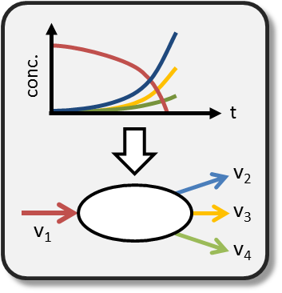

.. PhysioFit documentation master file, created by
   sphinx-quickstart on Mon Mar  7 14:29:46 2022.
   You can adapt this file completely to your liking, but it should at least
   contain the root `toctree` directive.

Welcome to PhysioFit documentation!
=====================================

**PhysioFit is a scientific tool designed to quantify cell growth parameters and uptake & production fluxes**

Fluxes are estimated using mathematical models by fitting time-course measurements of the concentration of
cells and extracellular substrates and products. PhysioFit is shipped with some common growth models, and
additional tailor-made models can be implemented by users.

**PhysioFit includes the following features:**

   * **calculation of growth rate and extracellular (uptake and production) fluxes**,
   * **a set of steady-state and dynamic models** are shipped with PhysioFit,
   * **tailor-made models** can be constructed by users,
   * Monte-Carlo sensitivity analysis to **estimate the precision of the calculated fluxes**,
   * **evaluation of the goodness of fit and visual inspection of the fitted curves**,
   * shipped as a **library** with both a **graphical** and a **command line** interface,
   * **open-source, free and easy to install** everywhere where Python 3 and pip run,
   * **biologist-friendly**.

It is one of the routine tools that we use at the
`MetaSys team <http://www.toulouse-biotechnology-institute.fr/en/research/molecular-physiology-and-metabolism/metasys.html>`_
and `MetaToul platform <http://www.metatoul.fr>`_ to calculate fluxes.

The code is open-source, and available on `GitHub <https://github.com/MetaSys-LISBP/PhysioFit/>`_ under a
:ref:`GPLv3 license <license>`.

This documentation is available on Read the Docs (`https://physiofit.readthedocs.io <https://physiofit.readthedocs.io/>`_)
and can be downloaded as a `PDF file <https://readthedocs.org/projects/physiofit/downloads/pdf/latest/>`_.

.. toctree::
   :maxdepth: 2
   :caption: User documentation

   installation.rst
   quickstart.rst
   method.rst
   usage.rst
   models.rst
   cite.rst

.. toctree::
   :maxdepth: 2
   :caption: Miscellaneous

   librairy.rst
   faq.rst
   license.rst

* :ref:`search`
