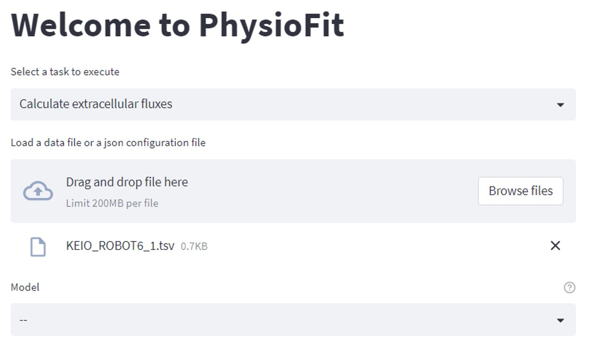

Quickstart
==========

.. seealso:: If you have already used PhysioFit and are looking for a more in-depth tutorial, check out the :doc:`usage`
             section.

In this section we will explain how to launch your first job once PhysioFit has been installed onto your system.

Graphical User Interface
--------------------------------------

To launch the graphical user interface or GUI, open up your preferred command-line utility and type:

.. code-block:: bash

  physiofit
 
If you installed the package in a specific environment, make sure to be in this environment before starting PhysioFit.

PhysioFit interface will open in a new browser window.

Select an input
data file (which can be a .tsv file containing the data or a json configuration file containing the run parameters and
a path towards the data, see :doc:`usage` for more details), modify the calculation parameters according to your experiment, 
and click on :samp:`Run flux calculation`. PhysioFit proceeds automatically to the flux calculation and display its progress and important messages. The output of the calculations (i.e. estimated fluxes) will be written in a text file along a log file.

Command Line Interface
----------------------

Implementation in progress...

Library
-------

PhysioFit is also available as a library (a Python module) that you can import directly in your Python
scripts:

.. code-block:: python

  import physiofit

.. seealso::  Have a look at our :ref:`library showcase <Library documentation>` if you are interested into this experimental feature.