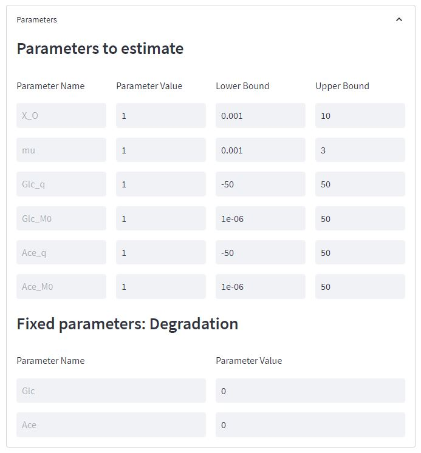

Tutorial
========

Required input data file
------------------------

The input data must be a tabulated file (.tsv extension) with the following structure:

+------+-----+---------+-----+
| time |  X  | Glucose | ... |
+======+=====+=========+=====+
| 1    | 0.2 |   13    | ... |
+------+-----+---------+-----+
| 2    | 0.3 |   12    | ... |
+------+-----+---------+-----+
| 2.5  | 0.4 |   10    | ... |
+------+-----+---------+-----+
| ...  | ... |   ...   | ... |
+------+-----+---------+-----+

Columns **time** and **X** (biomass concentration) are mandatory, as is at least one metabolite column(**Glucose** in
this example). If the biomass and metabolite concentrations were sampled at different moments, you can still group
them together in the same table (with an empty value when no data is available). If you have multiple experiments,
you must add an extra column containing the experiment name as such:

+-------------+-------+-----+---------+
|  experiments| time  |  X  | Glucose |
+=============+=======+=====+=========+
|  Condition1 | 1     | 0.4 |   13    |
+-------------+-------+-----+---------+
|  Condition1 | 2     | 0.6 |   12    |
+-------------+-------+-----+---------+
|  Condition2 | 1     | 0.3 |   15    |
+-------------+-------+-----+---------+
|  ...        | ...   | ... |  ...    |
+-------------+-------+-----+---------+

.. note:: Flux units depend on the units of time and concentrations (of biomass and metabolites) provided in the input
             data file. For instance, if biomass units are in grams of cell dry weight by liter (gDW/L), metabolite concentrations are in millimolar (mM) and time is
             in hours (h), the estimated fluxes will be in mmol/gDW/h. Units should thus be carefully selected, and calculated fluxes must be interpreted consistently with the concentration units.

.. warning:: The "experiments" column must only contain letters (no numbers) and is case-sensitive!

.. warning:: To limit any numerical instabilities, provide values in a range not too far from unity (e.g. if a metabolite
             concentration is 2 mM, provide the value directly in mM and not as 2e-3 M). The concentration of different metabolites can
             be provided using different units, but a single unit must be used for a given metabolite.

.. _yaml_config:

The yaml configuration file
---------------------------

The yaml configuration file contains all parameters required to calculate fluxes for a given experiment, and is
thus key to ensure **reproducibility** of the flux calculation process. A configuration file is generated automatically by 
PhysioFit during flux calculation; it can also be created or edited manually.

Here is an example of a configuration file:

.. image:: _static/usage/config_example.JPG
   :scale: 80%

For a description of all calculation parameters, check the section below.

.. _PhysioFit parameters:

Flux calculation parameters
---------------------------

The first run parameter to can modify is the **sensitivity analysis (Monte-Carlo)**, for which a check box signals if
the tool should estimate (or not) the precision on calculated fluxes. If checked, PhysioFit will let you choose the
number of monte carlo iterations. A higher number of iterations means more accurate confidence intervals on the
estimated parameters, but will slow down calculations. The default number of iterations (100) is sufficient in most
situations.

Next, the list of run parameters that you can tweak is dependant on the model you have selected. There are two types of
parameters: i) **parameters to estimate**, for which you can change the solution space bounds and the initial values and
ii) **fixed parameters** for which you can change the value. Here is an example when the steady-state without lag and
with metabolite degradation model is selected:

**Standard deviation** on measurements. A smaller value will augment the cost of the corresponding data during the
optimization, thereby forcing an improvement of the fit accuracy for this data, but degrading the fit accuracy for the
other measurements.

Finally, **Verbose logs**: Should debug information be written in log file. Useful in case of trouble (please join it
to the issue on github). Default: False

Other default values are model-based.

.. note:: Initial values and bounds should be carefully chosen. Ideally, initial values should be in the range of values
            used in the experiment. Well-defined bounds will enhance robustness and speed of the flux calculation
            process. The default bounds are sufficient in most cases, but may still be defined by the user when needed
            (e.g. the higher bound on initial metabolite concentrations should be increased if the initial concentration
            of substrate is higher than 50, since it is the maximal value allowed by default.).

.. _outputs_ref:

Output files
-------------

The following files are generated by PhysioFit in the output directory:

    * **config_file.yaml**: This is the configuration file containing all parameters used for the last run.
    * **flux_results.tsv**: Flux calculation results, i.e. fluxes and initial metabolite concentrations for the best fit, with associated precision.
    * **stat_results.tsv**: Results from the χ² statistical test.
    * **log.txt**: The run log containing information on how the run went.
    * **plots.pdf**: pdf file containing plots of simulated and measured data.
    * A number of **.svg files** containing the individual plots of simulated and measured data.
    * **recap.csv** file when multiple experiments have been analysed in one run

.. note::
   * When the data file (and not a yaml configuration file) is directly used as input in the Graphical User Interface,
     PhysioFit cannot get the path directly from the file metadata. For this reason, *path_to_data* is set to None in
     the generated *config_file.yaml*.
   * PhysioFit silently overwrites (results and log) files if they already exist. So take care to copy your results
     elsewhere if you want to protect them from overwriting.

The quality of the fit must be checked before interpreting the estimated fluxes by checking the *test_results.tsv* 
file, which contains the detailed χ² statistical test results and a clear status on the quality of the fit (based on a
95% confidence interval). The generated plots also help to visualize how accurately the simulated data fits the
experimental measurements. Finally, the confidence intervals estimated using the Monte-Carlo approach provides
quantitative information on the precision of the estimated fluxes (mean, median, standard deviation and 95% confidence
interval). Have a look to the :doc:`faq` section for help on interpreting the statistical results.
